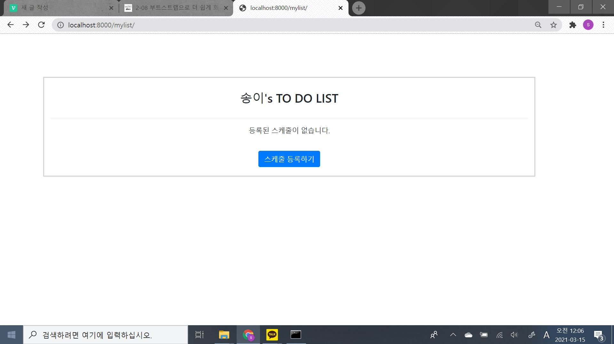
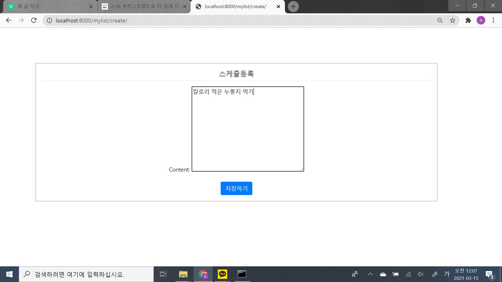
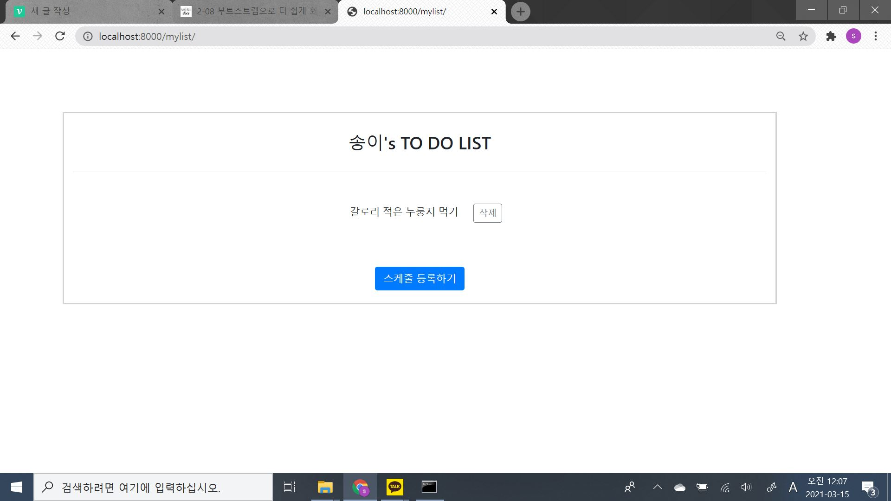
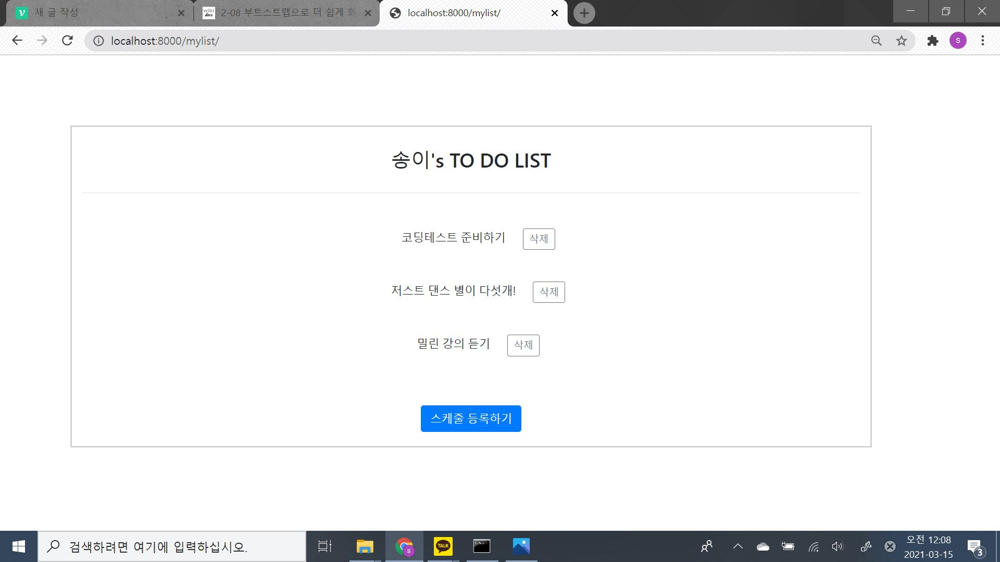

### django로 To-Do-List 만들기

#### 동기
- 2020년 3-2학기를 만들고 백엔드 공부를 해보고 싶었다.
- 코딩테스트를 파이썬으로 준비하기 시작했고, 그래서 같은 파이썬으로 가장 간단한 사이드 프로젝트를 진행해보았다.

#### 과정
- 먼저 django 프레임워크를 하나도 몰랐기에, <점프 투 장고>로 django 사용법을 아주 간단히 간단히 간단히 공부했다.
- 그 후 배웠던 것을 바탕으로 todolist를 구현해냈다.
- 이틀정도 소요.

#### 어려움
- 구현은 쉽고 빠르게 진행되었지만, 마지막 부트스트랩와 css 파일들이 먹히지않아 삽질을 오래했다..
- django엔 편리하고 더 빠르게 하는 기능이 많아보이는데, 사용하진 못했다.

#### 마치며
- django의 슬로건처럼 빠른 개발이 가능했다. 그래서인지 이게 맞다고? 라는 의문이 자꾸 들었다.
- nodejs나 ruby에선 DB 설정하고 당시 배우지도 않았었던 query문을 작성하고 이해하느랴 어려웠었는데, django는 DB사용도 쉬워 정---말 놀랐다.
- 웹 서버 프레임워크중엔 가장 흥미있고 재미있었다. 더 화려하고 어려운 기술도 써보고 싶다.

#### 결과

- 초기화면

- 리스트 추가 화면

- 추가 확인 화면

- 여러개 리스트 추가 및 삭제 화면